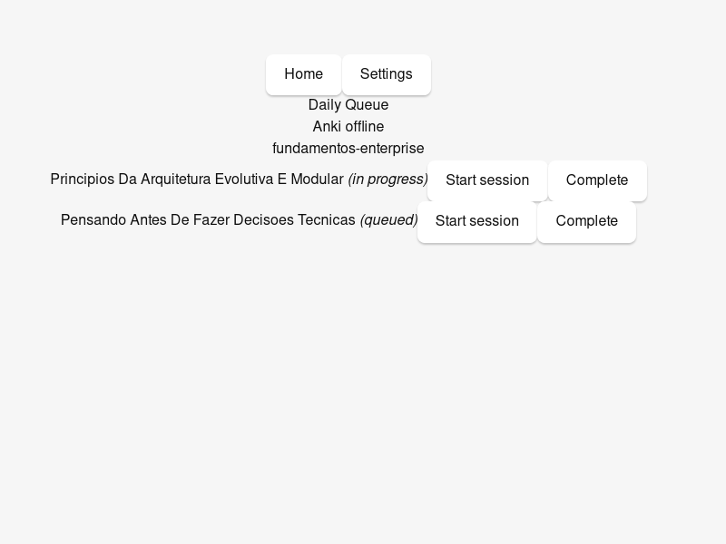
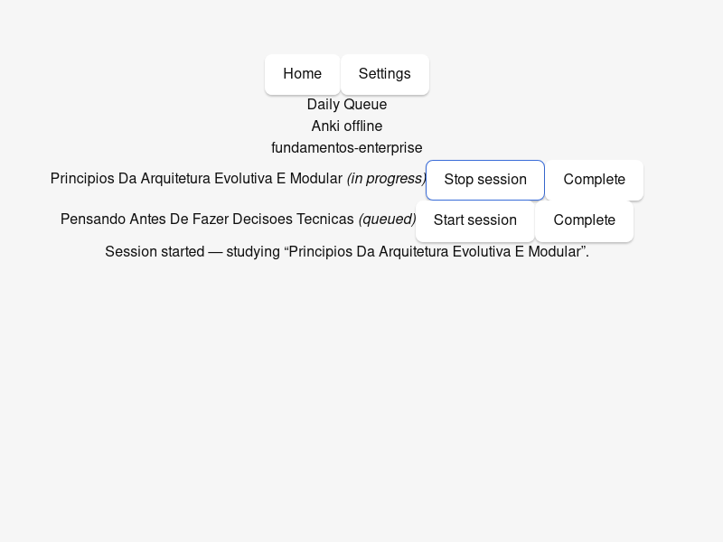
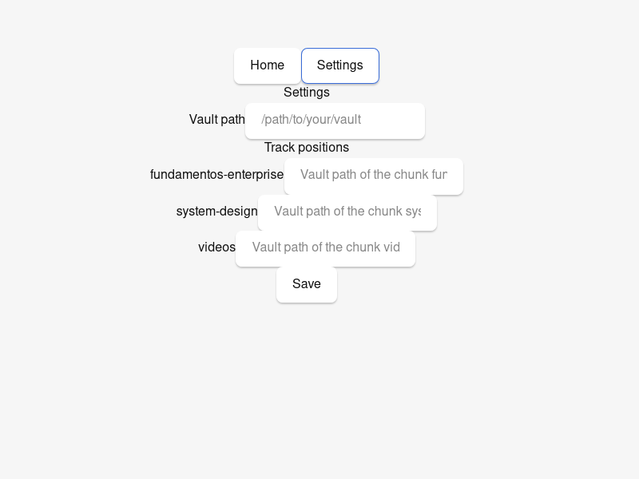

# disputatio

A local-first desktop study environment: a daily queue decides what you study, built-in FSRS owns your memory, voice narration makes you tell it back in your own words, and an AI tutor disputes your position before handing over answers.

Classically grounded (Aristotle, Aquinas, Sertillanges, Adler, Mason) and built as the study counterpart of a coding harness: the system decides what's next, captures what happened, and measures whether it's working — so the human spends cognition on studying, not on meta-studying.

Sibling to [learny](https://github.com/augusto-dmh/learny) (books, web). They share ideas and structure deliberately; they share no code and no data.

## Status

**Slice 0.1 — the Daily Queue — is live**: the app indexes an Obsidian vault (class tracks + videos, `scope.md` seeding, idempotent re-index), answers "what do I study now" per track (stale items flagged first, stable rotation), reads the Anki due total when AnkiConnect is up, and logs study sessions to Postgres — start, stop, duration, stage row — no manual dashboard edits.



The queue: per track the stale `in_progress` chunk first (untouched ≥ 14 days), then the fresh frontier, then the next chunk in course order; the Anki total rides in the header (or the offline note — it never gates the queue, [ADR 0004](docs/adr/0004-built-in-fsrs-review.md)).

| Starting a session | Study record lands in Postgres |
| --- | --- |
|  | stop writes end time, duration and the `lectio` stage row — verified via SQL (`sessions` ⋈ `session_stages`) |

Settings holds the vault path and the per-track position override (`track_position:<track>`): 

Reproduce the slice end-to-end against a real vault:

```text
make infra
DISPUTATIO_VAULT_PATH=/path/to/vault \
  cargo test --test smoke -- --ignored --nocapture   # from src-tauri
```

- Definition: [docs/PROJECT_BRIEF.md](docs/PROJECT_BRIEF.md) · Decisions: [docs/adr/](docs/adr/) · Process: [docs/PROCESS.md](docs/PROCESS.md) · Agent context: [AGENTS.md](AGENTS.md)

## Stack (decided — see ADRs)

- **Desktop:** Tauri 2 — TypeScript frontend, thin Rust backend ([ADR 0002](docs/adr/0002-desktop-stack-tauri2-typescript-thin-rust.md))
- **State:** PostgreSQL 16 in a Docker volume ([ADR 0003](docs/adr/0003-postgres-state-store-and-vault-as-knowledge-truth.md))
- **Memory:** FSRS via `rs-fsrs`, in the Rust backend, next to the database ([ADR 0004](docs/adr/0004-built-in-fsrs-review.md))
- **Knowledge truth:** the Obsidian vault, markdown. Postgres holds mutable and derived state; `Dashboard.md` is abolished — the queue screen is the dashboard ([ADR 0003](docs/adr/0003-postgres-state-store-and-vault-as-knowledge-truth.md))
- **AI:** direct LLM API first; agent sidecars later; MCP server post-1.0 ([ADR 0007](docs/adr/0007-ai-integration-staging.md))

## Harness

One-time: `make setup` (wires commit conventions), copy `.env.example` → `.env`. Then the vocabulary: `make infra` (Postgres), `make dev` (the app), `make check` (the gate — human, agent, and CI run the same command). Work is sized in three lanes ([docs/PROCESS.md](docs/PROCESS.md)); architecture boundaries are enforced as code ([scripts/fitness.py](scripts/fitness.py), [ADR 0008](docs/adr/0008-harness-day-one.md)).

## The daily loop (proposed — [ADR 0005](docs/adr/0005-classical-session-model.md))

**memoria** (clear due reviews) → **lectio** (ingest one next chunk) → **narratio** (tell it back, voice) → **disputatio** (argue your position before the answer is revealed) → **compositio** (leave an artifact).

The queue decides the quantities each day; the shape never changes.
